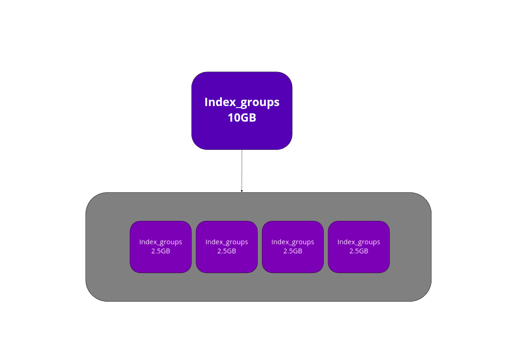

# tabela conseito

|Relacional | Elastic      |
|:---------:| :-----------:|
| Instancia | Index        |
| Tabela    | _doc or Type |
| Esquema   | Mapping      |
| Tupla     | Document     |
| Coluna    | Attribute    |
|:---------:| :-----------:|

# COMMAND

|    command   | Return        | desc                 | CURL                                                   |
|   :-------:  | :-----------: | :------------------: | :----------------------------------------------------: |
|    HEAD      | bool          |  format Statuse HTTP | `curl -IHEAD -v http://localhost:9200/catalogo/_doc/1` |
|   :-------:  | :-----------: | :------------------: | :----------------------------------------------------: |

## shards

Meu index armazenado em pedaços e armazernar em varios cluster.

Cada shards precisa ter menos de 50GB
